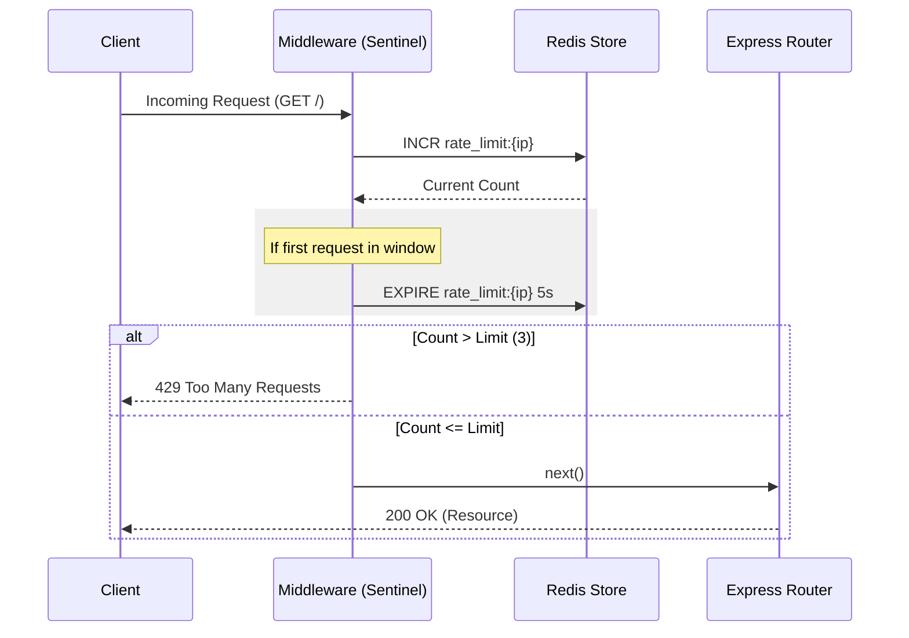

# ⚡ Sentinel: High-Performance Redis-Backed Rate Limiter

[](https://redis.io/)
[](https://nodejs.org/)
[](https://expressjs.com/)

**Sentinel** is a robust, production-ready rate limiting middleware for Express applications. Powered by Redis, it ensures your API remains stable and protected against brute-force attacks and traffic spikes with minimal latency.

---

## 🏗️ Architecture

The following diagram illustrates how Sentinel intercepts incoming requests and validates them against Redis-stored quotas.



---

## ⚙️ Working Principle

Sentinel implements the **Fixed Window Counter** algorithm:

1.  **Identification**: Each request is uniquely identified by the client's IP address.
2.  **Atomic Counting**: Uses the Redis `INCR` command to atomically increment the request counter for the current key.
3.  **Window Management**: If the key is new (count is 1), a TTL (Time To Live) is set using `EXPIRE` to define the rate limiting window.
4.  **Enforcement**: If the counter exceeds the predefined threshold (`MAX_REQUESTS`), the request is rejected with a `429` status code.

---

## 🚀 Getting Started

### Prerequisites

- [Node.js](https://nodejs.org/) (v14+)
- [Redis](https://redis.io/) server running locally or accessible via network.

### Installation

1.  **Clone the repository**:
    ```bash
    git clone https://github.com/your-username/rate-limiter-project.git
    cd rate-limiter-project
    ```

2.  **Install dependencies**:
    ```bash
    npm install
    ```

3.  **Start the server**:
    ```bash
    npm start
    ```

### Configuration

You can adjust the limits in `src/rateLimiter.js`:

```javascript
const WINDOW_SIZE = 5; // Window size in seconds
const MAX_REQUESTS = 3; // Maximum requests allowed per window
```

---

## 🛠️ Tech Stack

- **Framework**: Express.js
- **Database**: Redis (via `ioredis`)
- **Runtime**: Node.js

---

## 📜 License

Distributed under the ISC License. See `LICENSE` for more information.

---

<p align="center">
  Built with ❤️ for secure and scalable APIs.
</p>
