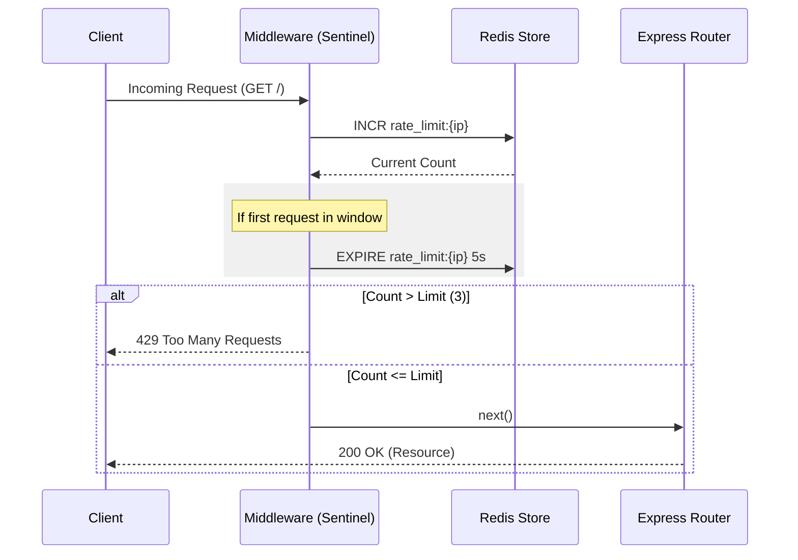

[sentinel_rate_limiter_animation.html](https://github.com/user-attachments/files/26339187/sentinel_rate_limiter_animation.html)# ⚡ Sentinel: High-Performance Redis-Backed Rate Limiter

[](https://redis.io/)
[](https://nodejs.org/)
[](https://expressjs.com/)

**Sentinel** is a robust, production-ready rate limiting middleware for Express applications. Powered by Redis, it ensures your API remains stable and protected against brute-force attacks and traffic spikes with minimal latency.

---

## 🏗️ Architecture

The following diagram illustrates how Sentinel intercepts incoming requests and validates them against Redis-stored quotas.



---

## ⚙️ Working Principle

Sentinel implements the **Fixed Window Counter** algorithm:

1.  **Identification**: Each request is uniquely identified by the client's IP address.
2.  **Atomic Counting**: Uses the Redis `INCR` command to atomically increment the request counter for the current key.
3.  **Window Management**: If the key is new (count is 1), a TTL (Time To Live) is set using `EXPIRE` to define the rate limiting window.
4.  **Enforcement**: If the counter exceeds the predefined threshold (`MAX_REQUESTS`), the request is rejected with a `429` status code.

[Upload
<style>
  * { box-sizing: border-box; margin: 0; padding: 0; }
  body { font-family: var(--font-sans); }

  @keyframes pulse { 0%,100%{transform:scale(1)} 50%{transform:scale(1.06)} }
  @keyframes shake { 0%,100%{transform:translateX(0)} 20%,60%{transform:translateX(-4px)} 40%,80%{transform:translateX(4px)} }
  @keyframes popIn { 0%{transform:scale(0.6);opacity:0} 70%{transform:scale(1.1)} 100%{transform:scale(1);opacity:1} }
  @keyframes slideRight { from{transform:translateX(-12px);opacity:0} to{transform:translateX(0);opacity:1} }
  @keyframes slideLeft { from{transform:translateX(12px);opacity:0} to{transform:translateX(0);opacity:1} }
  @keyframes fadeUp { from{transform:translateY(8px);opacity:0} to{transform:translateY(0);opacity:1} }
  @keyframes glow429 { 0%,100%{box-shadow:0 0 0 0 rgba(220,60,60,0)} 50%{box-shadow:0 0 0 6px rgba(220,60,60,0.18)} }
  @keyframes glow200 { 0%,100%{box-shadow:0 0 0 0 rgba(30,160,90,0)} 50%{box-shadow:0 0 0 6px rgba(30,160,90,0.18)} }
  @keyframes packetFly {
    0%   { left: 0%;   top: 50%; opacity: 1; }
    100% { left: 100%; top: 50%; opacity: 0.7; }
  }
  @keyframes packetFlyBack {
    0%   { right: 0%;  top: 50%; opacity: 1; }
    100% { right: 100%;top: 50%; opacity: 0.7; }
  }
  @keyframes blink { 0%,100%{opacity:1} 50%{opacity:0.3} }
  @keyframes counterBounce { 0%{transform:scale(1)} 30%{transform:scale(1.5)} 100%{transform:scale(1)} }
  @keyframes redFlash { 0%{background:rgba(220,60,60,0.25)} 100%{background:transparent} }

  .scene { width:100%; padding: 1.5rem 1rem 1rem; display:flex; flex-direction:column; gap:0; }

  /* Title bar */
  .title-bar { display:flex; align-items:center; gap:10px; margin-bottom:1.2rem; }
  .title-bar h2 { font-size:16px; font-weight:500; color:var(--color-text-primary); }
  .badge { font-size:11px; padding:3px 9px; border-radius:20px; font-weight:500; }
  .badge-live { background:var(--color-background-danger); color:var(--color-text-danger); animation: blink 1.8s ease-in-out infinite; }

  /* Main stage */
  .stage { display:grid; grid-template-columns: 1fr 60px 1fr 60px 1fr 60px 1fr; align-items:center; gap:0; margin-bottom:1rem; }

  /* Node boxes */
  .node-box { background:var(--color-background-primary); border:0.5px solid var(--color-border-tertiary); border-radius:var(--border-radius-lg); padding:14px 10px 12px; text-align:center; position:relative; transition: border-color 0.3s, box-shadow 0.3s; }
  .node-box h3 { font-size:12px; font-weight:500; color:var(--color-text-secondary); margin-bottom:6px; text-transform:uppercase; letter-spacing:0.04em; }
  .node-icon { font-size:22px; display:block; margin-bottom:4px; }
  .node-label { font-size:11px; color:var(--color-text-tertiary); line-height:1.3; }

  /* Client avatars */
  .clients { display:flex; flex-direction:column; gap:6px; align-items:center; }
  .client { display:flex; align-items:center; gap:6px; border-radius:8px; padding:4px 8px 4px 4px; border:0.5px solid var(--color-border-tertiary); background:var(--color-background-secondary); transition:all 0.2s; font-size:12px; color:var(--color-text-secondary); width:100%; }
  .client-avatar { width:24px; height:24px; border-radius:50%; display:flex; align-items:center; justify-content:center; font-size:11px; font-weight:500; flex-shrink:0; }
  .client.sending { border-color:var(--color-border-info); background:var(--color-background-info); }
  .client.blocked { border-color:var(--color-border-danger); background:var(--color-background-danger); animation: shake 0.4s; }
  .client.ok { border-color:var(--color-border-success); background:var(--color-background-success); }

  /* Arrow lane */
  .arrow-lane { position:relative; height:64px; overflow:hidden; display:flex; align-items:center; justify-content:center; flex-direction:column; gap:2px; }
  .arrow-line { width:100%; height:0.5px; background:var(--color-border-secondary); }
  .arrow-label { font-size:10px; color:var(--color-text-tertiary); white-space:nowrap; }
  .packet { position:absolute; width:10px; height:10px; border-radius:50%; top:calc(50% - 5px); pointer-events:none; }

  /* Redis counter */
  .redis-box { background:var(--color-background-primary); border:0.5px solid var(--color-border-tertiary); border-radius:var(--border-radius-lg); padding:12px 10px; text-align:center; }
  .redis-box h3 { font-size:12px; font-weight:500; color:var(--color-text-secondary); text-transform:uppercase; letter-spacing:0.04em; margin-bottom:8px; }
  .counter-grid { display:flex; flex-direction:column; gap:4px; }
  .ip-row { display:flex; justify-content:space-between; align-items:center; font-size:11px; border-radius:6px; padding:4px 6px; background:var(--color-background-secondary); border:0.5px solid var(--color-border-tertiary); }
  .ip-key { color:var(--color-text-tertiary); font-family:var(--font-mono); font-size:10px; }
  .ip-val { font-weight:500; font-size:13px; min-width:20px; text-align:center; border-radius:4px; padding:1px 4px; }
  .val-ok { color:var(--color-text-success); background:var(--color-background-success); }
  .val-warn { color:var(--color-text-warning); background:var(--color-background-warning); }
  .val-danger { color:var(--color-text-danger); background:var(--color-background-danger); }
  .ip-ttl { font-size:9px; color:var(--color-text-tertiary); font-family:var(--font-mono); }

  /* Middleware status */
  .middleware-status { font-size:11px; padding:3px 7px; border-radius:6px; display:inline-block; margin-top:6px; font-weight:500; }
  .ms-idle { color:var(--color-text-tertiary); background:var(--color-background-secondary); }
  .ms-checking { color:var(--color-text-info); background:var(--color-background-info); }
  .ms-pass { color:var(--color-text-success); background:var(--color-background-success); }
  .ms-block { color:var(--color-text-danger); background:var(--color-background-danger); }

  /* API response */
  .api-response { font-size:11px; padding:3px 7px; border-radius:6px; display:inline-block; margin-top:6px; font-weight:500; }
  .ar-idle { color:var(--color-text-tertiary); background:var(--color-background-secondary); }
  .ar-200 { color:var(--color-text-success); background:var(--color-background-success); animation: glow200 1s; }
  .ar-429 { color:var(--color-text-danger); background:var(--color-background-danger); animation: glow429 1s; }

  /* Log */
  .log-panel { border:0.5px solid var(--color-border-tertiary); border-radius:var(--border-radius-md); background:var(--color-background-secondary); padding:10px 12px; height:150px; overflow-y:auto; font-family:var(--font-mono); font-size:11px; display:flex; flex-direction:column; gap:3px; scroll-behavior:smooth; }
  .log-entry { animation: slideRight 0.2s ease; line-height:1.5; }
  .log-ok { color:var(--color-text-success); }
  .log-block { color:var(--color-text-danger); }
  .log-info { color:var(--color-text-secondary); }
  .log-redis { color:var(--color-text-info); }
  .log-ttl { color:var(--color-text-warning); }

  /* Controls */
  .controls { display:flex; gap:8px; flex-wrap:wrap; margin-top:1rem; align-items:center; }
  .btn { font-size:13px; padding:7px 14px; border-radius:var(--border-radius-md); border:0.5px solid var(--color-border-secondary); background:transparent; color:var(--color-text-primary); cursor:pointer; transition:all 0.15s; }
  .btn:hover { background:var(--color-background-secondary); }
  .btn:active { transform:scale(0.97); }
  .btn-primary { background:var(--color-background-info); border-color:var(--color-border-info); color:var(--color-text-info); }
  .btn-danger { background:var(--color-background-danger); border-color:var(--color-border-danger); color:var(--color-text-danger); }
  .config-row { display:flex; align-items:center; gap:8px; font-size:12px; color:var(--color-text-secondary); }
  .config-row input[type=range] { width:80px; }
  .config-val { font-family:var(--font-mono); font-weight:500; color:var(--color-text-primary); min-width:20px; }

  /* Stats bar */
  .stats-bar { display:flex; gap:12px; flex-wrap:wrap; margin-top:0.8rem; }
  .stat-pill { font-size:11px; padding:4px 10px; border-radius:20px; background:var(--color-background-secondary); border:0.5px solid var(--color-border-tertiary); color:var(--color-text-secondary); }
  .stat-pill span { font-weight:500; color:var(--color-text-primary); }

  /* Explanation panel */
  .explain { background:var(--color-background-secondary); border:0.5px solid var(--color-border-tertiary); border-radius:var(--border-radius-md); padding:10px 14px; font-size:12px; color:var(--color-text-secondary); line-height:1.6; margin-top:0.8rem; min-height:48px; animation: fadeUp 0.3s ease; }
  .explain strong { color:var(--color-text-primary); font-weight:500; }

  /* TTL bar */
  .ttl-bar-wrap { margin-top:4px; }
  .ttl-bar-track { height:4px; background:var(--color-background-secondary); border-radius:2px; overflow:hidden; }
  .ttl-bar-fill { height:100%; border-radius:2px; background:var(--color-border-info); transition:width 0.5s linear; }

  .node-box.active-node { border-color:var(--color-border-info); }
  .node-box.blocked-node { border-color:var(--color-border-danger); }
</style>

<div class="scene">
  <div class="title-bar">
    <h2>⚡ Sentinel — Live Rate Limiter Simulation</h2>
    <span class="badge badge-live">● LIVE</span>
  </div>

  <!-- Stage -->
  <div class="stage">
    <!-- Clients -->
    <div class="node-box" id="box-clients">
      <h3>Clients</h3>
      <div class="clients" id="clients-list"></div>
    </div>

    <!-- Arrow 1 -->
    <div class="arrow-lane" id="lane1">
      <div class="arrow-label">HTTP<br>Request</div>
      <div class="arrow-line"></div>
      <div id="p1" class="packet" style="display:none"></div>
    </div>

    <!-- Sentinel Middleware -->
    <div class="node-box" id="box-sentinel">
      <h3>Sentinel</h3>
      <span class="node-icon">🛡️</span>
      <div class="node-label">Express<br>Middleware</div>
      <div class="middleware-status ms-idle" id="mw-status">idle</div>
    </div>

    <!-- Arrow 2: to Redis -->
    <div class="arrow-lane" id="lane2">
      <div class="arrow-label">INCR<br>key</div>
      <div class="arrow-line"></div>
      <div id="p2" class="packet" style="display:none"></div>
    </div>

    <!-- Redis -->
    <div class="node-box" id="box-redis">
      <h3>Redis</h3>
      <span class="node-icon">🗄️</span>
      <div class="counter-grid" id="redis-counters">
        <div style="font-size:11px;color:var(--color-text-tertiary)">No keys yet</div>
      </div>
    </div>

    <!-- Arrow 3: to API -->
    <div class="arrow-lane" id="lane3">
      <div class="arrow-label">next()<br>or 429</div>
      <div class="arrow-line"></div>
      <div id="p3" class="packet" style="display:none"></div>
    </div>

    <!-- API -->
    <div class="node-box" id="box-api">
      <h3>Express API</h3>
      <span class="node-icon">🚀</span>
      <div class="node-label">GET /</div>
      <div class="api-response ar-idle" id="api-status">standby</div>
    </div>
  </div>

  <!-- Log -->
  <div class="log-panel" id="log"></div>

  <!-- Explanation -->
  <div class="explain" id="explain">
    Click <strong>Send Request</strong> to simulate a client hitting the API. Watch how Sentinel checks Redis and either passes or blocks the request.
  </div>

  <!-- Stats -->
  <div class="stats-bar">
    <div class="stat-pill">Allowed: <span id="stat-ok">0</span></div>
    <div class="stat-pill">Blocked: <span id="stat-blocked">0</span></div>
    <div class="stat-pill">Total: <span id="stat-total">0</span></div>
    <div class="stat-pill">Window: <span id="stat-window">5s</span></div>
    <div class="stat-pill">Limit: <span id="stat-limit">3 req/window</span></div>
  </div>

  <!-- Controls -->
  <div class="controls">
    <button class="btn btn-primary" onclick="sendOneRequest()">Send Request ↗</button>
    <button class="btn" onclick="startBurst()">🔥 Burst (5 rapid)</button>
    <button class="btn" onclick="resetAll()">↺ Reset</button>
    <div class="config-row">
      Max reqs/window:
      <input type="range" min="1" max="8" value="3" id="limit-slider" oninput="updateLimit(this.value)">
      <span class="config-val" id="limit-val">3</span>
    </div>
    <div class="config-row">
      Window:
      <input type="range" min="2" max="15" value="5" id="window-slider" oninput="updateWindow(this.value)">
      <span class="config-val" id="window-val">5s</span>
    </div>
  </div>
</div>

<script>
const CLIENTS = [
  { id:'A', label:'Alice', color:'#7F77DD', bg:'#EEEDFE' },
  { id:'B', label:'Bob',   color:'#0F6E56', bg:'#E1F5EE' },
  { id:'C', label:'Carol', color:'#993C1D', bg:'#FAECE7' },
];

let MAX_REQUESTS = 3;
let WINDOW_SIZE  = 5;
let counters = {};   // ip -> { count, expires, timerStart }
let statOk = 0, statBlocked = 0, statTotal = 0;
let animating = false;
let logCount = 0;

const $ = id => document.getElementById(id);
const sleep = ms => new Promise(r => setTimeout(r, ms));

function renderClients() {
  const el = $('clients-list');
  el.innerHTML = CLIENTS.map(c => `
    <div class="client" id="client-${c.id}">
      <div class="client-avatar" style="background:${c.bg};color:${c.color}">${c.id}</div>
      <span>${c.label}</span>
    </div>
  `).join('');
}

function updateLimit(v) {
  MAX_REQUESTS = parseInt(v);
  $('limit-val').textContent = v;
  $('stat-limit').textContent = v + ' req/window';
}

function updateWindow(v) {
  WINDOW_SIZE = parseInt(v);
  $('window-val').textContent = v + 's';
  $('stat-window').textContent = v + 's';
}

function setExplain(html) {
  const el = $('explain');
  el.innerHTML = html;
  el.style.animation = 'none';
  requestAnimationFrame(() => { el.style.animation = 'fadeUp 0.3s ease'; });
}

function addLog(text, cls = 'log-info') {
  const log = $('log');
  logCount++;
  const entry = document.createElement('div');
  entry.className = 'log-entry ' + cls;
  entry.textContent = '[' + String(logCount).padStart(3,'0') + '] ' + text;
  log.appendChild(entry);
  log.scrollTop = log.scrollHeight;
  if (log.children.length > 60) log.removeChild(log.children[0]);
}

function getCounter(ip) {
  const now = Date.now();
  if (!counters[ip] || now > counters[ip].expires) {
    counters[ip] = { count: 0, expires: now + WINDOW_SIZE * 1000, timerStart: now };
  }
  return counters[ip];
}

function renderRedis() {
  const el = $('redis-counters');
  const now = Date.now();
  const ips = Object.keys(counters);
  if (!ips.length) { el.innerHTML = '<div style="font-size:11px;color:var(--color-text-tertiary)">No keys yet</div>'; return; }
  el.innerHTML = ips.map(ip => {
    const c = counters[ip];
    if (now > c.expires) return '';
    const ttlLeft = Math.max(0, Math.round((c.expires - now)/1000));
    const pct = Math.max(0, Math.min(100, ((c.expires - now) / (WINDOW_SIZE*1000)) * 100));
    const valCls = c.count >= MAX_REQUESTS ? 'val-danger' : c.count === MAX_REQUESTS-1 ? 'val-warn' : 'val-ok';
    return `
      <div class="ip-row">
        <div>
          <div class="ip-key">${ip}</div>
          <div class="ip-ttl">TTL: ${ttlLeft}s</div>
          <div class="ttl-bar-wrap">
            <div class="ttl-bar-track"><div class="ttl-bar-fill" style="width:${pct}%"></div></div>
          </div>
        </div>
        <div class="ip-val ${valCls}">${c.count}/${MAX_REQUESTS}</div>
      </div>`;
  }).filter(Boolean).join('');
  if (!el.innerHTML.trim()) el.innerHTML = '<div style="font-size:11px;color:var(--color-text-tertiary)">Windows expired</div>';
}

function flyPacket(laneId, color, direction = 'right') {
  const lane = $(laneId);
  const p = lane.querySelector('.packet') || lane;
  const dot = lane.querySelector('.packet');
  dot.style.display = 'block';
  dot.style.background = color;
  dot.style.borderRadius = '50%';
  if (direction === 'right') {
    dot.style.left = '0%'; dot.style.right = '';
    dot.style.animation = 'none';
    dot.offsetWidth;
    dot.style.transition = 'left 0.45s ease-in-out, opacity 0.45s';
    dot.style.left = '90%'; dot.style.opacity = '1';
  } else {
    dot.style.right = '0%'; dot.style.left = '';
    dot.style.transition = 'right 0.45s ease-in-out, opacity 0.45s';
    dot.style.right = '90%'; dot.style.opacity = '0.5';
  }
  setTimeout(() => { dot.style.display = 'none'; dot.style.left='0'; dot.style.right=''; dot.style.opacity='1'; }, 500);
}

function highlightBox(id, type) {
  const el = $(id);
  el.classList.remove('active-node','blocked-node');
  if (type === 'active') el.classList.add('active-node');
  if (type === 'blocked') el.classList.add('blocked-node');
  setTimeout(() => el.classList.remove('active-node','blocked-node'), 900);
}

function setMwStatus(cls, text) { const el = $('mw-status'); el.className = 'middleware-status ' + cls; el.textContent = text; }
function setApiStatus(cls, text) { const el = $('api-status'); el.className = 'api-response ' + cls; el.textContent = text; }

let requestQueue = [];
let processing = false;

function pickClient() {
  return CLIENTS[Math.floor(Math.random() * CLIENTS.length)];
}

async function sendOneRequest(client) {
  client = client || pickClient();
  requestQueue.push(client);
  if (!processing) processQueue();
}

async function processQueue() {
  if (processing || !requestQueue.length) return;
  processing = true;
  const client = requestQueue.shift();
  await runRequest(client);
  processing = false;
  if (requestQueue.length) processQueue();
}

async function runRequest(client) {
  statTotal++;
  $('stat-total').textContent = statTotal;

  const ip = `rate_limit:${client.id}`;
  const cEl = $('client-' + client.id);
  cEl.classList.add('sending');

  setMwStatus('ms-idle','idle');
  setApiStatus('ar-idle','standby');

  addLog(`${client.label} → GET / (IP: ${client.id})`, 'log-info');
  highlightBox('box-clients','active');
  flyPacket('lane1', client.color);
  await sleep(500);

  setMwStatus('ms-checking','⚙ checking...');
  highlightBox('box-sentinel','active');
  setExplain(`<strong>Step 1 — Identify:</strong> Sentinel extracts the client IP (<code>${client.id}</code>) from the request and builds Redis key <code>${ip}</code>.`);
  await sleep(500);

  flyPacket('lane2', '#378ADD');
  addLog(`Redis INCR ${ip}`, 'log-redis');
  await sleep(500);

  const c = getCounter(client.id);
  c.count++;
  const count = c.count;
  const isNew = count === 1;

  highlightBox('box-redis','active');
  if (isNew) {
    addLog(`Redis EXPIRE ${ip} ${WINDOW_SIZE}s (new window started)`, 'log-ttl');
    setExplain(`<strong>Step 2 — Atomic INCR:</strong> Key is new! Count = <strong>1</strong>. Sentinel sets EXPIRE to <strong>${WINDOW_SIZE}s</strong> — the rate window begins now. ⏱️`);
  } else {
    setExplain(`<strong>Step 2 — Atomic INCR:</strong> Redis atomically increments the counter to <strong>${count}</strong>. Window expires in <strong>${Math.round((c.expires - Date.now())/1000)}s</strong>.`);
  }
  renderRedis();
  await sleep(500);

  const blocked = count > MAX_REQUESTS;

  if (blocked) {
    setMwStatus('ms-block',`🚫 blocked (${count}/${MAX_REQUESTS})`);
    cEl.classList.remove('sending');
    cEl.classList.add('blocked');
    highlightBox('box-sentinel','blocked');
    flyPacket('lane3', '#E24B4A');
    setApiStatus('ar-429','429 Too Many Requests');
    addLog(`BLOCKED ${client.label} — count ${count} > limit ${MAX_REQUESTS} → 429`, 'log-block');
    statBlocked++;
    $('stat-blocked').textContent = statBlocked;
    setExplain(`<strong>Step 3 — BLOCKED! 🚫</strong> Count <strong>${count}</strong> exceeds max <strong>${MAX_REQUESTS}</strong>. Sentinel returns <strong>HTTP 429 Too Many Requests</strong> immediately — the request never reaches the API.`);
    await sleep(600);
    cEl.classList.remove('blocked');
  } else {
    setMwStatus('ms-pass',`✓ pass (${count}/${MAX_REQUESTS})`);
    flyPacket('lane3', '#1D9E75');
    addLog(`ALLOWED ${client.label} — count ${count}/${MAX_REQUESTS} → next()`, 'log-ok');
    highlightBox('box-api','active');
    setApiStatus('ar-200','200 OK ✓');
    statOk++;
    $('stat-ok').textContent = statOk;
    if (count === MAX_REQUESTS) {
      setExplain(`<strong>Step 3 — Allowed (last slot!) ⚠️</strong> Count <strong>${count}</strong> reaches the limit. This request passes, but the <em>next</em> request from <strong>${client.label}</strong> in this window will be blocked.`);
    } else {
      setExplain(`<strong>Step 3 — Allowed ✅</strong> Count <strong>${count}</strong> is within the limit of <strong>${MAX_REQUESTS}</strong>. Sentinel calls <code>next()</code> and the request flows to the Express router → <strong>200 OK</strong>.`);
    }
    await sleep(500);
    cEl.classList.remove('sending');
    cEl.classList.add('ok');
    await sleep(400);
    cEl.classList.remove('ok');
  }

  await sleep(350);
  setMwStatus('ms-idle','idle');
  setApiStatus('ar-idle','standby');
}

async function startBurst() {
  const client = pickClient();
  addLog(`--- Burst: 5 rapid requests from ${client.label} ---`, 'log-info');
  setExplain(`<strong>Burst mode!</strong> Sending 5 rapid-fire requests from <strong>${client.label}</strong> to demo rate limiting in action...`);
  for (let i = 0; i < 5; i++) {
    requestQueue.push(client);
    await sleep(80);
  }
  if (!processing) processQueue();
}

function resetAll() {
  counters = {};
  statOk = 0; statBlocked = 0; statTotal = 0;
  $('stat-ok').textContent = 0;
  $('stat-blocked').textContent = 0;
  $('stat-total').textContent = 0;
  $('log').innerHTML = '';
  logCount = 0;
  requestQueue = [];
  processing = false;
  renderRedis();
  setMwStatus('ms-idle','idle');
  setApiStatus('ar-idle','standby');
  setExplain('Simulation reset. Click <strong>Send Request</strong> or <strong>Burst</strong> to try again.');
  addLog('--- Simulation reset ---', 'log-info');
}

setInterval(() => {
  const now = Date.now();
  let changed = false;
  for (const ip in counters) {
    if (now > counters[ip].expires) { delete counters[ip]; changed = true; }
  }
  if (changed || Object.keys(counters).length) renderRedis();
}, 500);

renderClients();
addLog('Sentinel middleware loaded — Redis connected', 'log-redis');
addLog(`Config: MAX_REQUESTS=${MAX_REQUESTS}, WINDOW_SIZE=${WINDOW_SIZE}s`, 'log-info');
</script>
ing sentinel_rate_limiter_animation.html…]()

---

## 🚀 Getting Started

### Prerequisites

- [Node.js](https://nodejs.org/) (v14+)
- [Redis](https://redis.io/) server running locally or accessible via network.

### Installation

1.  **Clone the repository**:
    ```bash
    git clone https://github.com/your-username/rate-limiter-project.git
    cd rate-limiter-project
    ```

2.  **Install dependencies**:
    ```bash
    npm install
    ```

3.  **Start the server**:
    ```bash
    npm start
    ```

### Configuration

You can adjust the limits in `src/rateLimiter.js`:

```javascript
const WINDOW_SIZE = 5; // Window size in seconds
const MAX_REQUESTS = 3; // Maximum requests allowed per window
```

---

## 🛠️ Tech Stack

- **Framework**: Express.js
- **Database**: Redis (via `ioredis`)
- **Runtime**: Node.js

---

## 📜 License

Distributed under the ISC License. See `LICENSE` for more information.

---

<p align="center">
  Built with ❤️ for secure and scalable APIs.
</p>
